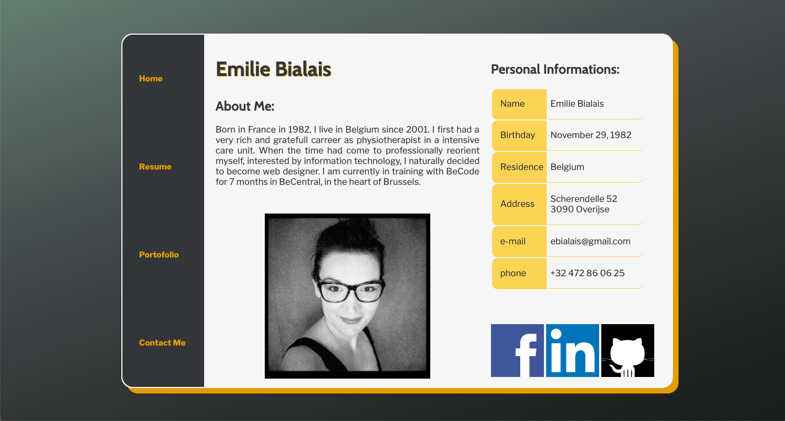

# VCard

After 10 days of training, we had to create a VCard. 

The aim of the exercice was to : 
		* have a clean and well indented html file
		* CSS : 
		- have a clear and understandable file
		- avoid repetition or unnecessary lines of code
		- master grid
		- master the background gradient
		
## Visual

file:///Users/emiliebialais/Desktop/BeCode/VCard/index.html

